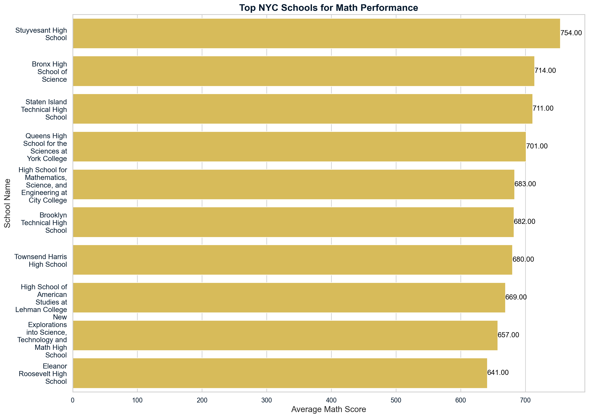

Given dataset: [school.csv](data/school.csv)

### Inspecting the Data

```
[5 rows x 7 columns]
(375, 7)
<class 'pandas.core.frame.DataFrame'>
RangeIndex: 375 entries, 0 to 374
Data columns (total 7 columns):
 #   Column           Non-Null Count  Dtype  
---  ------           --------------  -----  
 0   school_name      375 non-null    object 
 1   borough          375 non-null    object 
 2   building_code    375 non-null    object 
 3   average_math     375 non-null    int64  
 4   average_reading  375 non-null    int64  
 5   average_writing  375 non-null    int64  
 6   percent_tested   355 non-null    float64
dtypes: float64(1), int64(3), object(3)
memory usage: 20.6+ KB

```
### Critical Variables
- **Total Sat Scores**
- **Math Performance (Average Math Score)**
- **Standard Deviation of SAT Scores**

### Question 1: Which NYC schools have the best math results?
The goal of this question is to identify schools with the best math results, defined as schools that scored at least 80% of the maximum possible math score (800).

```
# Objective process
# 1. Define threshold for "best" math results
# Ranges of score 0 and 800 (max possible score)
# "best" math score threshold = 80%
# 80% of 800 = 0.8×800 = 640

math_threshold = 0.8 * 800

# 2. Create a new dataframe for NYC schools that have the best math results.
# Filter schools with this boolean condition: average_math column >= math_threshold which is 640
# Filter out the dataframe with only the rows where the condition is satisfied: schools_copy[condition]

best_math_schools = schools_copy[schools_copy['average_math'] >= math_threshold]

# Sort by 'average_math' in descending order after filtering
best_math_schools_sorted = best_math_schools.sort_values(by='average_math', ascending=False)

# Select only the relevant columns: "school_name" and "average_math"
best_math_schools = best_math_schools_sorted[['school_name', 'average_math']]

# Display the result
print(best_math_schools)

# 3. Sort the values of average_math column in the created dataframe = best_math_schools, from highest to lowest (descending order)
best_math_schools_sorted = best_math_schools.sort_values(by='average_math', ascending=False)
print(best_math_schools_sorted)

# 4. After sorting, extract the top 10
top_10_math_schools = best_math_schools_sorted.head(10)
print(top_10_math_schools)
```

We created a DataFrame `best_math_schools`, containing the **school_name** and **average_math** columns, and sorted the schools by **average_math** in descending order.

### Insights:
- **Stuyvesant High School** stands out with the highest math score, achieving an average of 780, nearly perfect.
- Many of the top-performing schools have **average math scores well above 700**, suggesting a highly competitive environment in math for top-tier schools in NYC.
- The math results can serve as a basis for comparing overall academic performance and may highlight schools with specialized programs or better resources in math education.



---

### Question 2: What are the top 10 performing schools based on the combined SAT scores?
We created a new `total_SAT` column by summing the **math**, **reading**, and **writing** scores for each school, and sorted them to find the top 10 performing schools.

We saved the results as a DataFrame `top_10_schools`, including the **school_name** and **total_SAT** columns.
```
# Objective process
#1. Create a new column 'Total_SAT' to the dataframe with the calculated total SAT score for each school (Pandas) 
# combined_score = average_math + average_reading + average_writing
schools_copy['total_SAT'] = schools_copy['average_math'] + schools_copy['average_reading'] + schools_copy['average_writing']

#2. Sort the dataframe by 'total_SAT' in descending order
top_schools_sorted = schools_copy.sort_values(by='total_SAT', ascending=False)

#3. Select the top 10 schools and include only the 'school_name' and 'total_SAT' columns
    # Display the result
top_10_schools = top_schools_sorted[['school_name', 'total_SAT']].head(10)
print(top_10_schools)
```
### Insights:
- **Stuyvesant High School** leads the top 10 schools with the highest combined SAT score of **2271**.
- The difference in SAT scores between the **top school** and the **10th-ranked school** is significant, roughly 200 points, indicating a gap between top and mid-level performers.
- These top 10 schools represent the cream of NYC’s academic performance and serve as a model for other schools seeking to improve SAT scores and overall academic outcomes.


### Question 3: Which single borough has the largest standard deviation in the combined SAT score?
To answer this, we calculated the **standard deviation of total_SAT** for each borough to determine where the greatest variability in SAT scores exists.

We saved the results in the DataFrame `largest_std_dev`, which contains:
- **borough**: The name of the borough with the largest standard deviation.
- **num_schools**: The number of schools in that borough.
- **average_SAT**: The mean SAT score in that borough.
- **std_SAT**: The standard deviation of SAT scores in that borough.
```
# Step 1: Group data by 'borough' and calculate required statistics
borough_stats = schools_copy.groupby('borough')['total_SAT'].agg(
    std_SAT='std',       # Standard deviation of total_SAT
    average_SAT='mean',  # Mean of total_SAT
    num_schools='count'  # Count of schools in each borough
).reset_index()

# Round all numeric values to two decimal places
borough_stats = borough_stats.round(2)

# Display the result (All boroughs with their stats)
print(borough_stats)
```
### Insights:
- **Manhattan** has the highest standard deviation in SAT scores, indicating a **wide disparity** in school performance.
- This suggests that while some schools in Manhattan are top performers, others are far behind, and targeted educational interventions could help reduce this variability.
- The high **standard deviation** in Manhattan reveals significant differences in the academic outcomes of its schools, despite having several top-ranking schools.


```markdown   
**Borough-Level Analysis:**
   Manhattan has the highest standard deviation in SAT scores, indicating the greatest variability among schools. Here are the borough statistics:

   | Borough    | Num Schools | Average SAT | Std Dev |
   |------------|-------------|-------------|---------|
   | Manhattan  | 89          | 1340.13     | 230.29  |

---
```


